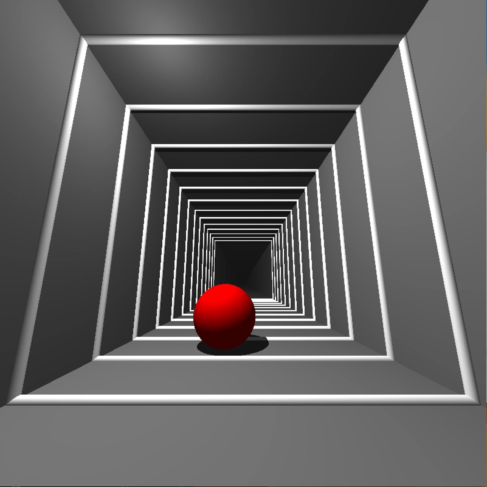
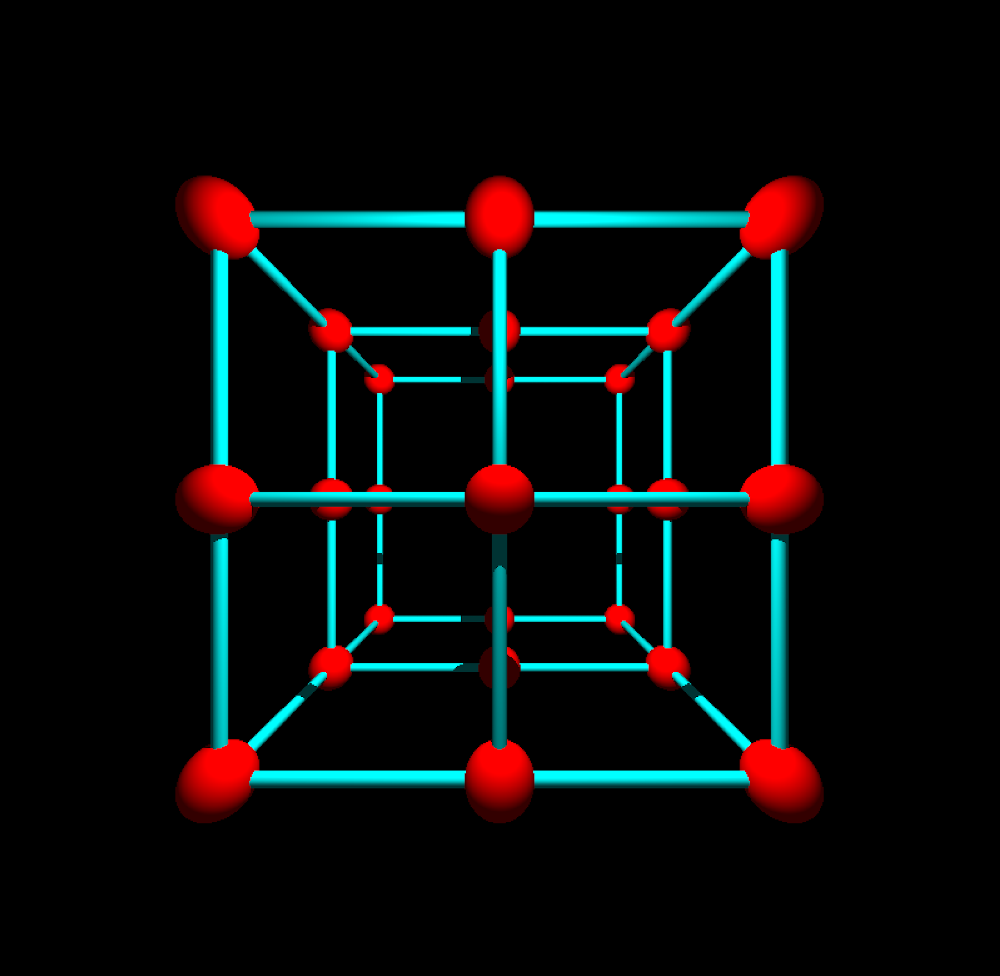
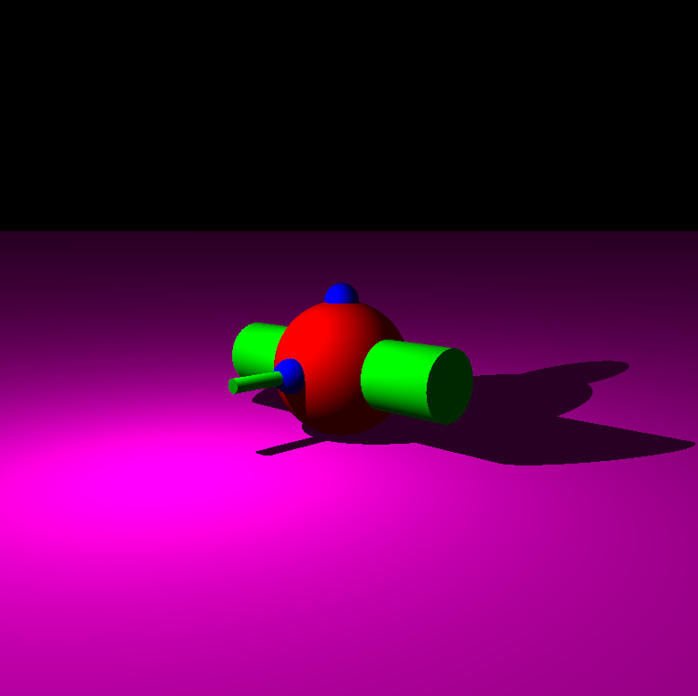
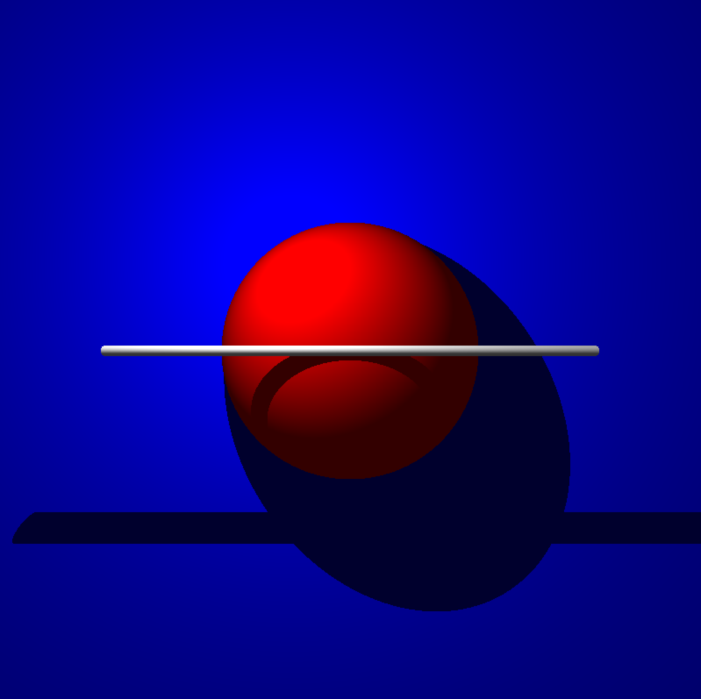
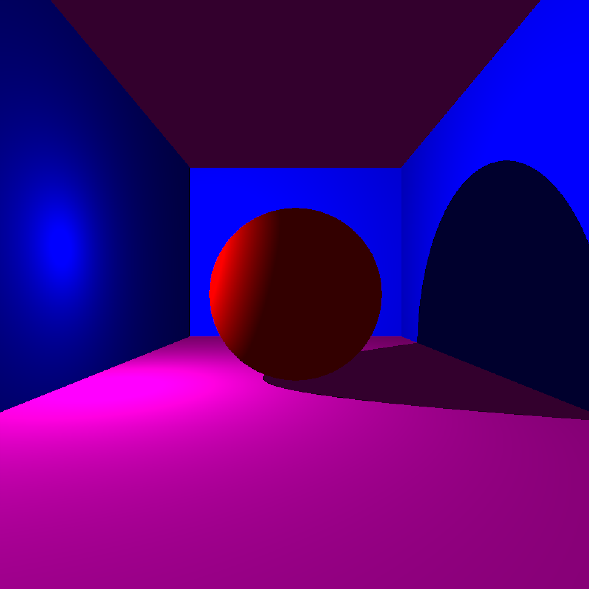

# MiniRT — Ray Tracing Engine in C

A fully functional 3D ray tracing engine built from scratch in C as part of the 42 School curriculum. Renders 3D scenes with geometric primitives, lighting, and real-time interactive controls.
The use of external rendering libraries and shortcuts was strictly forbidden.

---

## Table of Contents

- [Overview](#overview)
- [Features](#features)
- [Screenshots](#screenshots)
- [Getting Started](#getting-started)
- [Scene File Format](#scene-file-format)
- [Controls](#controls)
- [Project Structure](#project-structure)
- [Technical Highlights](#technical-highlights)
- [About](#about)

---

## Overview

MiniRT implements a **ray casting renderer** entirely in C. For each pixel on screen, it shoots a ray from the camera into the scene, tests it against every geometric object, finds the closest intersection, and computes the final color based on lighting and shadows.

**Key concepts demonstrated:**
- Ray-object intersection math (spheres, planes, cylinders)
- Phong-style lighting model (ambient + diffuse + shadows)
- Camera projection and field-of-view
- Real-time event-driven rendering loop
- Manual memory management and custom data structures in C

---

## Features

### Geometric Primitives
| Shape | Intersection Method |
|---|---|
| Sphere | Quadratic formula (ray-sphere equation) |
| Plane | Plane equation with surface normal |
| Cylinder | Quadratic with cap detection |

### Lighting
- **Ambient light** — global scene illumination with configurable ratio
- **Point light** — single directional light with configurable brightness
- **Diffuse shading** — Lambertian reflection (dot product of normal vs light direction)
- **Shadow casting** — secondary ray to check occlusion before applying diffuse light

### Camera
- Configurable position, direction, and field of view (degrees)
- Orthonormal camera basis computed via cross products
- Perspective projection through a virtual viewport

### Interactivity (Real-Time)
- Move and rotate the camera
- Translate, rotate, and resize scene objects
- Move the light source
- Adjust field of view with scroll

---

## Screenshots







---

## Getting Started

### Requirements

- Linux (uses X11/MLX graphics)
- `gcc`, `make`, `git`
- X11 development libraries: `libxext-dev`, `libx11-dev`

```bash
# Ubuntu/Debian
sudo apt install libxext-dev libx11-dev
```

### Build

```bash
git clone https://github.com/miguandr/MiniRT.git
cd MiniRT
make
```

The Makefile automatically downloads and compiles [minilibx-linux](https://github.com/42Paris/minilibx-linux) if not present.

### Run

```bash
./miniRT tests/03_basic_shapes.rt
```

Pass any `.rt` scene file as the argument.

---

## Scene File Format

Scenes are defined in `.rt` plain-text files. Each line represents one element.

```
# Ambient light: ratio (0.0–1.0)  R,G,B
A  0.2  255,255,255

# Point light: x,y,z  ratio
L  -10,15,30  0.7

# Camera: x,y,z  dx,dy,dz  FOV
C  0,0,50  0,0,-1  100

# Sphere: x,y,z  diameter  R,G,B
sp  0,0,0  40  255,0,0

# Plane: x,y,z  nx,ny,nz  R,G,B
pl  0,-20,0  0,1,0  100,100,200

# Cylinder: x,y,z  nx,ny,nz  diameter  height  R,G,B
cy  0,0,20  1,0,0  1.0  50  255,255,255
```

See the [`tests/`](tests/) directory for full example scenes.

---

## Controls

Press `M` in-window to display the full control menu.

| Key | Action |
|---|---|
| `W` / `A` / `S` / `D` | Move camera |
| `↑` `↓` `←` `→` | Translate selected object |
| `Z` / `X` / `C` / `V` | Rotate selected object |
| `1` / `2` | Resize selected object |
| `I` / `K` / `J` / `L` / `O` / `P` | Move light source |
| Mouse scroll | Adjust camera FOV |
| `ESC` | Exit |

---

## Project Structure

```
MiniRT/
├── includes/
│   └── minirt.h          # All structs, prototypes, macros
├── sources/
│   ├── main.c            # Entry point, argument validation
│   ├── error/
│   │   └── error.c       # Error handling and cleanup
│   ├── parser/           # .rt file parsing (one file per element type)
│   │   ├── parser.c
│   │   ├── ambient.c
│   │   ├── camera.c
│   │   ├── light.c
│   │   ├── sphere.c
│   │   ├── plane.c
│   │   └── cylinder.c
│   ├── render/           # Core ray tracing pipeline
│   │   ├── render.c
│   │   ├── render_camera.c
│   │   ├── render_sphere.c
│   │   ├── render_plane.c
│   │   ├── render_cylinder.c
│   │   ├── color.c
│   │   └── events.c
│   └── utils/            # Vector math and helpers
│       ├── vector_utils.c
│       └── utils.c
├── libft/                # Custom C standard library (47 functions)
├── tests/                # 14 .rt scene files for validation
└── Makefile
```

---

## Technical Highlights

### Ray-Object Intersection

Each ray is tested against every object in the scene. For spheres, intersection is solved via the quadratic formula derived from substituting the ray equation into the sphere equation. For cylinders, this extends to handle both the lateral surface and circular caps.

### Lighting Model

Color at each hit point is computed as:

```
color = ambient + (1 - in_shadow) * diffuse
diffuse = light_ratio * dot(surface_normal, light_direction) * object_color
```

A secondary "shadow ray" is cast from the hit point toward the light. If it hits any object before reaching the light, the point is in shadow and only ambient light applies.

### Camera Basis

The camera builds an orthonormal coordinate system at setup:
- `aim` — normalized forward direction
- `right` — `cross(world_up, aim)`, normalized
- `up` — `cross(aim, right)`, normalized

This basis maps pixel coordinates to world-space ray directions using the FOV to compute viewport dimensions.

### Custom libft

All standard utility functions are implemented from scratch: string manipulation, memory operations, linked lists, `printf`, `get_next_line`, and floating-point parsing (`ft_atof`). No `libc` string or memory functions are used in the project itself.

---

## My Role

Built as a team of 2. I owned the **rendering pipeline, camera system, and lighting**:

**Core ray tracer**
- **`render.c`** — Per-pixel ray generation, closest intersection selection across all object types, dispatch to the color engine
- **`color.c` / `color_utils.c`** — Lighting model: ambient contribution, Lambertian diffuse shading (`dot(normal, light_dir)`), shadow ray casting with self-intersection bias; packs final RGB into 32-bit TRGB and writes to the framebuffer

**Camera system**
- **`render_camera.c`** — Orthonormal camera basis (`right`, `up`, `aim`) built via cross products; FOV→radians conversion; per-pixel delta vectors that map 2D screen coordinates to 3D world-space rays

**Vector math & interactivity**
- **`vector_utils.c` / `vector_utils_2.c`** — Full vector math library (add, subtract, dot, cross, normalize, scale)
- **`events.c` / `events_utils.c` / `events_utils_2.c`** — Real-time keyboard/mouse controls for camera, objects, and light

My partner ([@dtorretta](https://github.com/dtorretta)) implemented the geometric intersection solvers (sphere, plane, cylinder), the scene file parser, error handling, and test scenes.

---

## About

Built as **MiniRT**, a mandatory project in the 42 School core curriculum (Rank 4). The goal is to implement a ray tracer from first principles, applying linear algebra, computer graphics theory, and systems programming in C, with zero tolerance for memory leaks or undefined behavior.

**Skills demonstrated:** C, ray tracing, 3D math, X11/MLX, memory management, modular architecture, Makefile, event-driven programming.
